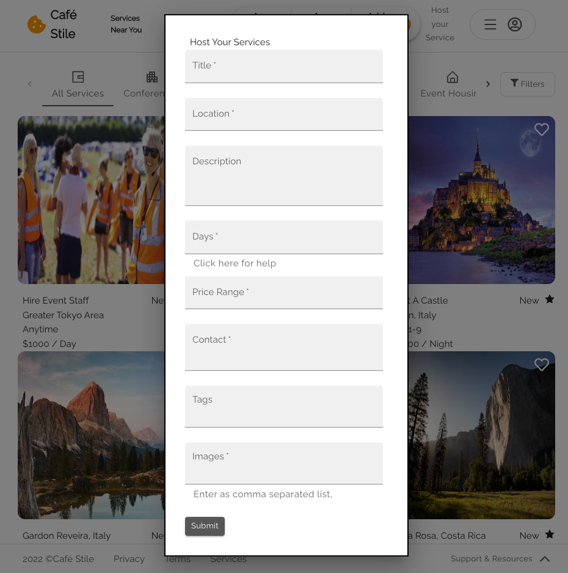

# Café Stile
Café Stile is a Marketplace web application for location-dependent services and gigs. Services offered might range from venue rentals and event organization to dog walking and babysitting.

### Note:
Project Home-page was created following [this](https://www.youtube.com/watch?v=1k3HxJRBVgI&t=166s) guide/tutorial on MUI.

### Tech Stack:
#### Client-side:
 - HTML/CSS
 - React.js
 - Material UI

#### Server-side:
 - Django
 - Django REST Framework, Djoser
 - PostgreSQL

### Install and Run:
Run the following commands in the CLI of the root folder:
 - 'npm install --legacy-peer-deps'
 - 'npm run start'

Run the following commands in the CLI of the server folder:
 - 'cd backend'
 - 'python3 manage.py runserver'

You can find the deployed application [here.](https://main.d3f2th40mcptld.amplifyapp.com/)

Happy exploring!
